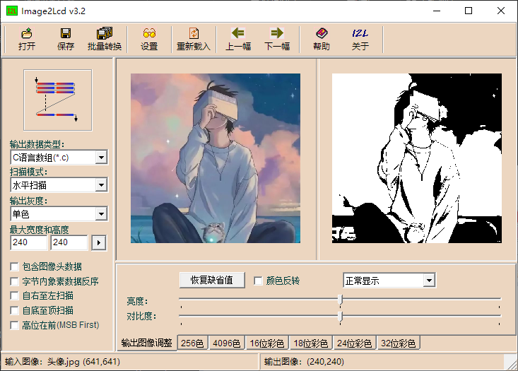

# `Img2arr`: 重新定义图片取模

### **告别格式限制，迎接无尽可能**

> **请注意：Img2arr 正处于积极开发阶段，尚未发布最小可行产品。我们正在构建一个革命性的工具，需要您的洞察与贡献。**

---

## 🚀 为什么是 Img2arr？

如果您熟悉嵌入式开发，那么下面这个场景一定不陌生：

**我们深受其益，也饱受其限。**

经典的 `Image2Lcd` 功能强大，但已与现代工作流脱节：**32位架构、封闭的生态、僵化的格式，以及无法跨越的240x240分辨率鸿沟。**

而 GitHub 上的现代替代品，往往走向另一个极端：界面美观，但**功能极度有限**，无法应对真实开发中“千奇百怪”的屏幕格式。

**我们发现了这片空白，并决心终结这种妥协。**

---

## 💡 核心愿景

Img2arr 不满足于成为“又一个”取模工具。它的使命是提供一个**强大、灵活且面向未来的开源解决方案**，从根本上解决图片取模的痛点。

- **🛠️ 真正的格式自由**：通过创新的 **“位拖拽”** 插件，自由定义任何颜色格式，轻松应对所有现有和未来的屏幕。
- **⚡ 工业级性能**：采用 C++/Python 混合架构与并行计算，**13ms 内完成 4K 图像处理**。
- **🔧 强大的处理管线**：可自由串联的预处理流程（缩放、抖动、色彩调整等），满足复杂的预处理需求。
- **🌐 生于开源，长于开源**：基于 Qt 的跨平台图形界面，依托 AGPLv3 协议和插件生态，确保软件永不过时。

---

## 📜 许可证

本项目基于 **[GNU Affero General Public License v3.0](LICENSE)** 开源。项目成熟后，将提供商业许可选项。

---

## 🤝 加入我们，共同塑造未来

**恭喜你阅读至此！**

Img2arr 的成功离不开像您一样洞察到市场空白的开发者。我们不仅需要代码贡献，更需要您对架构、需求和插件的真知灼见。

**如果您对以下任何一项感兴趣：**
- 参与核心架构讨论
- 贡献代码或插件
- 提供宝贵的使用场景和建议

我们诚挚邀请您**点亮 Star**，关注项目动态，并随时准备加入我们的讨论。

**together, let's redefine the toolchain.**
